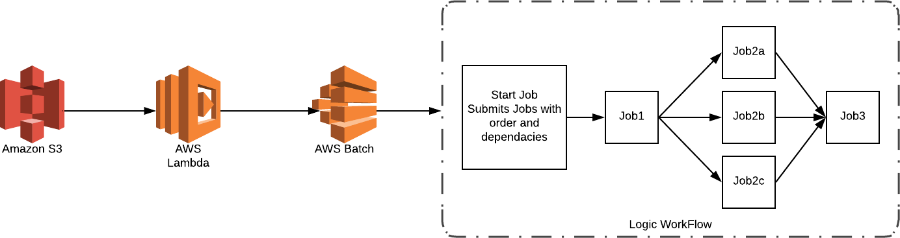

# AWS Batch Example
## Objective
This is example of the Amazon Batch Service to deploy an example batch workflow. This example is meant to be a deployable artifact POC. This example will use CloudFormation, AWS Lambda, Docker, AWS Batch, and an S3 bucket trigger.

The batch workflow created in this example is not a prescription for how batch processing should be done but merely an example. In this example all of the jobs for the workflow are scheduled at once. In doing so your scheduler could pass environment variables or change the command of each job to instruct the jobs where to store data, and where to expect data. Another approach would be to, have processing jobs schedule their dependent jobs, instructing those dependent jobs where to find the data that they produced. There are many ways batch processing can be utilized, this is simply an example. 

### Why I Think Batch is Cool
* AWS Batch can manage the infrastructure for you, scaling up or down based on the number of jobs in queue.
* AWS Batch is able to scale vertically as well, when your Compute Environment Instance Type is set to "optimal".
* AWS Batch can automatically bid on spot instances for you.
* Your Job queues can be worked by multiple Compute Environments.
  * You can set preference for a Spot Instance Compute Environment
  * When your first Compute Environment is unavailable or over worked the job can be picked up by the next.
* Job Queues have priority, which means you can have high priority jobs completed first.
* Job Definitions can be either docker tasks or Lambda Functions.
* Job Definitions can have default environments, mount points, volumes, CMD, etc.
* Job Definition defaults can be overrode on Submission
* Jobs can have dependencies
* You can run an array of the same job, making Monte Carlo simulations a breeze.

---

## **Note: You are responsible for the costs incurred by running this example.**

The example is limited to a total of 24 CPU's at a given time unless altered, and defaults to 0 running instances when no jobs are in queue.

---

## Diagram



## Preparation and Demonstration
Before you jump head first into AWS Batch you need code for batch to run. AWS batch is able to run docker container tasks, and AWS Lambda Functions. This example will use docker container tasks, and a Lambda function to submit a job when an object is created or modified in a S3 bucket. This repository consists of everything you will need to build the proof of concept. There is a prep script that will build the Lambda code into a zip package and upload it to a S3 Bucket. This script will then validate you have ECR repositories available to host the docker container images that are used, fetch credentials for the ECR repositories, then build and push the images. After this you will deploy the CloudFormation to produce the AWS Batch POC. This documentation will walk you through running all of the commands and explain what they do.

### Assumptions:
* You have an AWS Account.
* You’re using Bash.
* You have pip installed. [Help](https://pip.pypa.io/en/stable/installing/)
* You have the AWS CLI installed, preferred version 1.11.108 or greater. [Help](https://docs.aws.amazon.com/cli/latest/userguide/installing.html)
* You have configured the CLI, set up AWS IAM access credentials that have appropreate access. [Help](https://docs.aws.amazon.com/cli/latest/reference/configure/index.html)
* You have docker installed. [Help](https://docs.docker.com/install/)
* You have a Ec2 KeyPair in your AWS Account / Default Region [Help](https://docs.aws.amazon.com/AWSEC2/latest/UserGuide/ec2-key-pairs.html)
* You have a VPC with at least two subnets that have internet access, you can use the default VPC. [Help](https://docs.aws.amazon.com/AmazonVPC/latest/UserGuide/default-vpc.html)

### Step 1: Create a S3 Bucket.
You will need a S3 bucket to work out of, we will use this bucket to upload our lambda code zip. Create the bucket with the following CLI command or through the console. Keep in mind that S3 bucket names are globally unique and you will have to come up with a bucket name for yourself.
```
aws s3 mb s3://aws_batch_example_{yourName} (--profile optionalProfile)
```

### Step 2: Clone the example Github project.
I have prepared a Github project with all of the example CloudFormation and code to get you off the ground. Clone this Github project to your local machine.

https://github.com/dejonghe/aws-batch-example

### Step 3: Run the env_prep Script.
To prepare
You must run a script from within the Github project. This script is to be ran from the base of the repository. If you rename the repository directory you will need to edit the [script](./scripts/env_prep.sh), all the variables are at the top.

This script performs the following tasks:
1. Builds and and uploads the lambda code
  * The script creates a temp directory
  * Copies the code from [lambda trigger](./lambda/trigger/) to the temp directory
  * Uses pip to install the requirements to the temp directory
  * Zips up the contents of the temp directory to a package named ./lambda/trigger.zip
  * Removes the temp directory
  * Uploads the zip to `s3://{yourBucket}/{release(develop)}/lambda/trigger.zip`
2. Creates and or Validates ECR Repositories
  * The script will validate you have two ECR Repositories: ['batchpocstart','batchpocprocess']
  * If either of the repositories are missing it will create them.
3. Get docker login credentials for the repositories
  * The script uses `aws ecr get-login` piped to `bash`
4. Docker images are built and pushed
  * The script moves into the directory containing the Dockerfiles
  * [batchpocstart](./docker/batchpocstart/): Has a small python application that schedules jobs that depend on each other.
  * [batchpocprocess](./docker/batchpocprocess/): Is just a busybox container that runs `echo "hello world"` to emulate work.
  * Once in the given directory the script will use the docker command line tool to build the image.
  * The images are tagged to match the repository created previously. {accountId}.dkr.ecr.{region}.amazonaws.com/{repoName}:latest
  * Images are pushed to ECR.

The following is an example of running the script. **Note:** You can pass -p profile, and -r release (Your aws-cli profile's default regions is used)
```
./scripts/env_prep.sh -b aws_batch_example_{yourName} (-p optionalProfile -r optionalRelease)
```

### Step 4: Create the CloudFormation Stack.
This step utilizes the [CloudFormation Template](./cloudformation/batch/batch-example.yml) to produce the batch environment and supporting resources and hooks. You can upload this template directly to the AWS CloudFormation Console, or use the following command. The console will provide drop downs for the networking and Ec2 KeyPair parameters. If you use the command line you'll have to look these up yourself to fill out the command line arguments. If you want SSH access to the batch instances, ensure that the VPCCidr parameter is set to the Cidr of your VPC, it's used for the batch instance security group. You must provide IAM capabilities to this CloudFormation stack because we must create an IAM role for the lambda function, the batch instances, and the batch containers. A full description of the CloudFormation stack and what it creates can be found in the [README.md](./cloudformation/batch/README.md)


```
aws cloudformation create-stack --template-body file://cloudformation/batch/batch-example.yml --stack-name batch-example --parameters '[{"ParameterKey":"CloudToolsBucket","ParameterValue":"aws_batch_example_{yourName}"},{"ParameterKey":"VPCCidr","ParameterValue":"10.0.0.0/16"},{"ParameterKey":"VPC","ParameterValue":"vpc-xxxxxxxx"},{"ParameterKey":"Subnets","ParameterValue":"subnet-xxxxxxxx,subnet-xxxxxxxx"},{"ParameterKey":"Ec2KeyPair","ParameterValue":"{yourKeyPairName}"}]' --capabilities CAPABILITY_NAMED_IAM (--profile optionalProfile)

```

Wait for the CloudFormation stack to complete and then check in on the Batch Dashboard.

### Step 6: Exercise the demo
#### Upload to S3
The CloudFormation stack created a S3 bucket. When a object is created or updated in this bucket, a notification triggers the lambda to submit a job to AWS batch. The S3 bucket is named: `batch-poc-{yourAccountId}-{region}`. Upload a file to this bucket through the console or with the following command and watch a job get submitted to AWS Batch.
```
aws s3 cp ./README.md s3://batch-poc-{yourAccountId}-{region}/ (--profile optionalProfile)
```

#### Watch the Batch Dashboard
From the Batch Dashboard you should see the Queue, and Compute Environment. You will be able to track the status of jobs from the Dashboard. **Make sure to refresh**

1. You'll see a job appear in the submitted state.
2. It will quickly jump to Pending then to Runnable.
3. Once the job is runnable there will need to be a instance in the Compute Environment to run the job.
4. Note that the current Desired vCPUs for your Compute Environment is initially 0. This means you have 0 instance in your Compute Environment.
5. As the job becomes runnable Batch will start to launch an EC2 instance for the job to run on. This can take a few minutes.
  * To keep a Batch Compute Environment warm so you do not have to wait, up the Minimum vCPUs.
6. Once your Compute Environment is online you will see your job move to starting.
  * This can take a few moments for the first run because the instance needs to pull down the container image.
7. Your Job will then move to running for a brief second, and then to Success or Failed.
8. Whether you job is a Success or Failure, if you click into the link you will be taken to the Jobs Dashboard for that Status.
9. Click the JobId. You will see detail appear on the right hand side.
10. In the detail you will see link to view logs. Click on it to explore.
11. If the first job was successful, 5 other jobs will be submitted and move through the different status's.
  * Note that when the group of 5 is submitted some stay in pending, and do not immediately go to runnable. This is because those jobs have dependencies.
12. Now submit a job manually through the Jobs Dashboard.
  * Play with running jobs different ways.
  * Try submitting an Array.
13. Find other ways to trigger batch jobs:
  * The lambda function allows you to integrate with anything that can invoke lambda or SNS, though you'll have to edit the permissions.
  * Check out the CloudWatch Events trigger for AWS Batch, to trigger based on CloudWatch Event rules/patterns or a time schedule.
